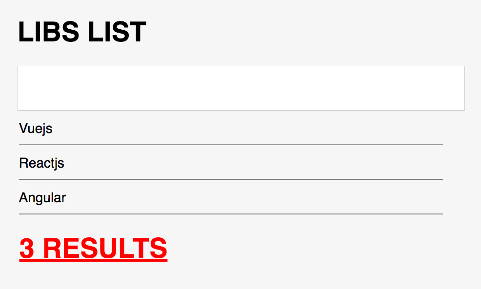

# [TALK] VueJS as a gateway drug
If you want to try some cool stuff, you should just start with some light drugs, such as VueJS. This will give you the basis to stronger stuff like ReactJS, Angular, Preact, Inferno, whatever...

## Goal of the talk
In this talk it was covered basic VueJS functionalities creating a simple list of strings as shown on the image below:


## Topics covered
```
[
  'cli',
  'init',
  'structure',
  'data',
  'filters',
  'methods',
  'mounted',
  'v-if',
  'v-for',
  'v-bind (:)',
  'v-on (@)',
  'v-model',
  'components',
  'slot',
  'props',
  'shortcuts (: and @)'
]
```
